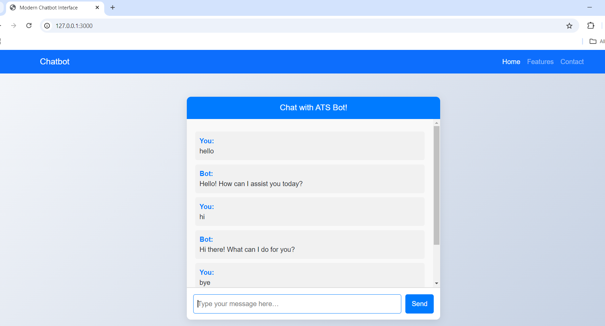

# 🚀 **Modern Chatbot Interface**  
A chatbot web interface built with **Node.js**, **Express**, **Bootstrap**, and **MongoDB**.

## 🌐 **Live Demo**
Check out the live version of the chatbot here:  
[**Hosted Chatbot Website**](https://chatwithats.onrender.com)

## 🎯 **Project Overview**

This project demonstrates a simple chatbot interface that:
- Accepts user input and responds with predefined messages.
- Saves the conversation history to **MongoDB**.
- Is built with a responsive frontend using **Bootstrap**.
  
## 🛠️ **Technologies Used**
- **Frontend**: HTML5, CSS, Bootstrap, JavaScript
- **Backend**: Node.js, Express.js
- **Database**: MongoDB (Mongoose)
  
## ✨ **Features**
- 💬 **Chat Interface**: Users can interact with the bot through a clean and modern interface.
- 🗂️ **Predefined Responses**: The bot responds to common queries like greetings, jokes, and more.
- 💾 **Database Integration**: User queries and bot responses are saved in MongoDB.
  
## 🚀 **Getting Started**

Follow these steps to set up the project on your local machine:

### 📋 **Prerequisites**
Make sure you have the following installed:
- [Node.js](https://nodejs.org/) (v14 or higher)
- [MongoDB](https://www.mongodb.com/try/download/community)

### 🔧 **Installation**

1. **Clone the repository**:
   ```bash
   git clone https://github.com/yourusername/modern-chatbot.git
2.Navigate to the project folder:

    bash
    cd modern-chatbot
    
3.Install dependencies:

    bash
    npm install
    Start MongoDB (Make sure MongoDB is running on your local machine).

4.Run the app:

    bash
    Copy code
    npm start

5.Open your browser and go to:

    arduino
    http://localhost:3000
    
⚙️ Configuration
If you want to configure the database or any other settings, update the .env file:

makefile

    MONGO_URI=<your_mongodb_connection_string>
    PORT=3000
🌟 Usage
Type messages into the chat box.
The bot will respond based on predefined replies (e.g., greetings, jokes).
The conversation will be stored in the MongoDB database.
📝 Predefined Responses
The bot is programmed to respond to certain key phrases:

"hello" → "Hello! How can I assist you today?"
"tell me a joke" → "Why don't scientists trust atoms? Because they make up everything!"
"bye" → "Goodbye! Have a great day!"

## Screenshots

### Home Page

